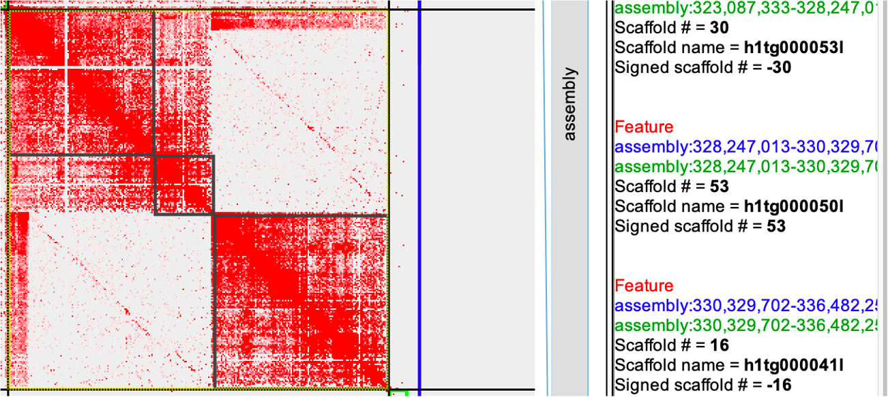
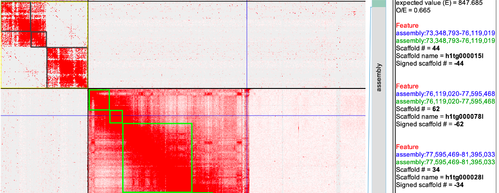
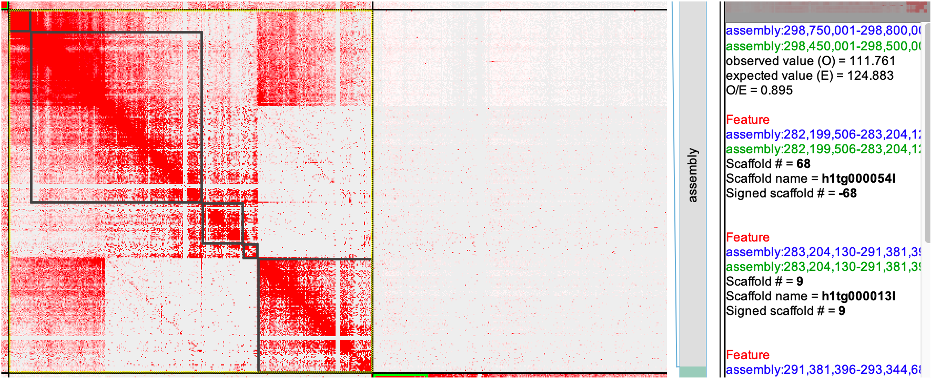
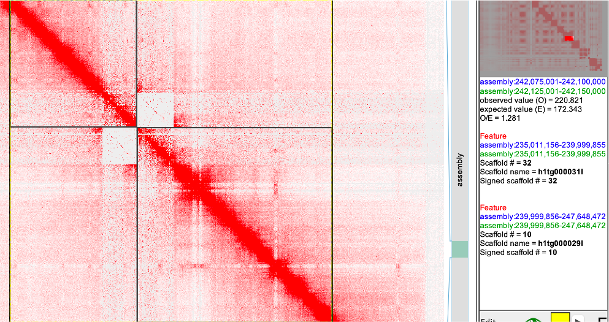
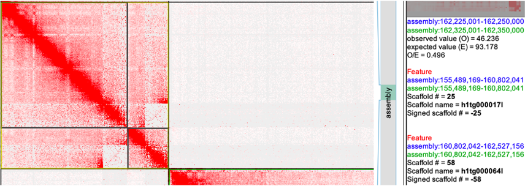
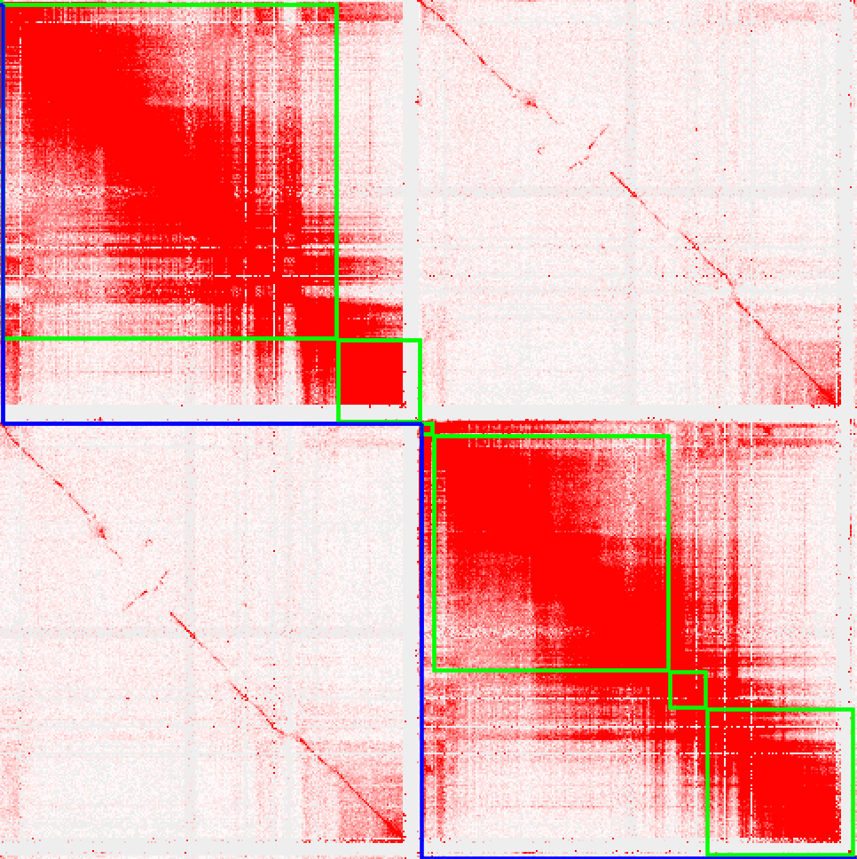

# phased-assembly-check

## 1. Haplotype-resolved ctg

- Trio
```shell

#! Two identical name

yak count -b37 -t16 -o pat.yak <(zcat pat_1.fq.gz pat_2.fq.gz) <(zcat pat_1.fq.gz pat_2.fq.gz)
yak count -b37 -t16 -o mat.yak <(zcat mat_1.fq.gz mat_2.fq.gz) <(zcat mat_1.fq.gz mat_2.fq.gz)
hifiasm -o HG002.asm -t32 -1 pat.yak -2 mat.yak HG002-HiFi.fa.gz
```
- HiC
```shell
hifiasm -o HG002.asm -t32 --h1 read1.fq.gz --h2 read2.fq.gz HG002-HiFi.fq.gz
```

- Evaluation
```shell
## yak (https://github.com/lh3/yak)

yak trioeval pat.yak mat.yak HG002.asm.trio.hap1.p_ctg.fa > HG002.asm.hap1.trioeval
yak trioeval pat.yak mat.yak HG002.asm.trio.hap2.p_ctg.fa > HG002.asm.hap2.trioeval

grep "^S"  HG002.asm.hap1.trioeval|cut -f2-4,9|awk '{print $0"\tpat"}' >> F1.trio.tsv
grep "^S"  HG002.asm.hap2.trioeval|cut -f2-4,9|awk '{print $0"\tmat"}' >> F1.trio.tsv

## Merqury

Follow the https://github.com/marbl/merqury/wiki/3.-Phasing-assessment-with-hap-mers

```

Plot kmer with yak result
```

data <- read.table("./F1.trio.tsv",header=F,sep="\t")
colnames(data) <- c("ctg","Pat","Mat","Len","Type")
data$Len <- data$Len/1e6

library(ggplot2)
library(ggsci)

pal <- pal_locuszoom()(5)

p <- ggplot()+
  geom_point(data=data,aes(x=Pat,y=Mat,size=Len,color=Type),alpha=0.5)+
  scale_color_manual(values=c("#D43F3AFF","#357EBD"))+
  theme_bw()

```


## 2. Haplotype-aware scaffolding

### Remove Haplotype-specific HiC reads (with Trio data) 
[VGP case](https://www.nature.com/articles/s41586-021-03451-0)

```shell
meryl-lookup -memory 2 -exclude -mers pat.meryl -sequence $read1 -sequence2 $read2 -r2
mat.R2.fastq.gz | pigz -c > mat.R1.fastq.gz
meryl-lookup -memory 2 -exclude -mers mat.meryl -sequence $read1 -sequence2 $read2 -r2
pat.R2.fastq.gz | pigz -c > pat.R1.fastq.gz 

# Using https://github.com/marbl/merqury/blob/master/trio/exclude_reads.sh

bash /data/software/Merqury/merqury/trio/exclude_reads.sh mat.hapmer.meryl f1.hic.R1.fq.gz f1.hic.R2.fq.gz pat
```
### Scaffold two haplotype together and check (recommend for HiC only)

- Medium heterozygosity or with high ROH

If your sample's heterozygosity is medium (ex. < 1%) or have long ROH , combining two haplotype and run HiC scaffolding will have lots of empty region of HiC heatmap (casued by homozygous region). You may need to scaffolding sepreate using HiC reads for chromsome first,then combine haplotype for haplotype-specific inversion check. Or you can use all HiC reads (no MQ filter) for chrosome scaffolding and check the haplotype-specfic inversion with filtering (MQ>1 or MQ>10). This is how we scaffold the tetraploid potato [Genome architecture and tetrasomic inheritance of autotetraploid potato](https://www.cell.com/molecular-plant/fulltext/S1674-2052(22)00191-5)
 
- High heterozygosity
    - run juicer + 3d-dna / AllHiC (MQ>1) 
    - Loading into JuiceBox for visualization
        - False duplication (Examples are based on the hifiasm 0.15.4 for high het plant genome with trio data)
            - Fig1
                > 
                > |     seqName        |     #matKmer    |     #patKmer    |     #pat-pat    |     #pat-mat    |     #mat-pat    |     #mat-mat    |     seqLen     |
                > |--------------------|-----------------|-----------------|-----------------|-----------------|-----------------|-----------------|----------------|
                > |     h1tg000041l    |          160    |        10644    |           77    |           83    |           82    |        10561    |     6152553    |
                > |     h1tg000053l    |        50105    |           62    |        50059    |           45    |           45    |           17    |     5159680    |
                > |     h1tg000050l    |        17945    |           27    |        17924    |           20    |           20    |            7    |     2082689    | 
                Conclusion: Remove the h1tg000041l

            - Fig2
                > 
                > |     seqName        |     #patKmer    |     #patKmer    |     #pat-pat    |     #pat-mat    |     #mat-pat    |     #mat-mat    |     seqLen     |
                > |--------------------|-----------------|-----------------|-----------------|-----------------|-----------------|-----------------|----------------|
                > |     h1tg000015l    |           87    |          164    |           51    |           35    |           36    |          128    |     2770227    |
                > |     h1tg000078l    |           42    |           66    |           24    |           18    |           18    |           47    |     1476449    |
                > |     h1tg000028l    |         7532    |           87    |         7478    |           53    |           53    |           34    |     3799565    |
                Conclusion: Remove the h1tg000015l and h1tg000028l

            - Fig3
                > 
                > |     seqName        |     #patKmer    |     #patKmer    |     #pat-pat    |     #pat-mat    |     #mat-pat    |     #mat-mat    |     seqLen     |
                > |--------------------|-----------------|-----------------|-----------------|-----------------|-----------------|-----------------|----------------|
                > |     h1tg000054l    |         6908    |           10    |         6899    |            8    |            8    |            2    |     1004624    |
                > |     h1tg000013l    |        25643    |          330    |        25547    |           95    |           96    |          234    |     8177266    |
                > |     h1tg000059l    |           57    |          245    |           25    |           32    |           32    |          212    |     1963293    |
                > |     h1tg000056l    |           12    |           29    |            4    |            7    |            7    |           22    |      685156    |
                > |     h1tg000052l    |        25905    |          219    |        25816    |           88    |           88    |          131    |     5467035    |
                Conclusion: Remove the h1tg000059l and h1tg000056l, 52l vs (54l+13l) maybe real
            - Fig4
                > 
                > |     seqName        |     #patKmer    |     #patKmer    |     #pat-pat    |     #pat-mat    |     #mat-pat    |     #mat-mat    |     seqLen     |
                > |--------------------|-----------------|-----------------|-----------------|-----------------|-----------------|-----------------|----------------|
                > |     h1tg000031l    |        17138    |        12244    |        17075    |           63    |           63    |        12180    |     4988700    |
                > |     h1tg000029l    |        44167    |          139    |        44067    |           99    |           99    |           40    |     7648617    |
                Conclusion: utg overlap. Find the utg in the `gfa` and remove rerun the `utg` trioeval and decide.

            - Fig5
                > 
                > |     seqName        |     #patKmer    |     #patKmer    |     #pat-pat    |     #pat-mat    |     #mat-pat    |     #mat-mat    |     seqLen     |
                > |--------------------|-----------------|-----------------|-----------------|-----------------|-----------------|-----------------|----------------|
                > |     h1tg000017l    |        39991    |           89    |        39929    |           61    |           61    |           28    |     5312873    |
                > |     h1tg000064l    |         1572    |         5187    |         1540    |           31    |           32    |         5155    |     1725115    |
                Conclusion: utg overlap. Find the utg in the gfa and remove.
                
     

    - Misplaced haplotype
      If you find the `hap1` ctg have more strong interaction with the hap2, and `trioeval` support it, you need manually move `this hap1` ctg to hap2

    - Haplotype-specific inversion
      - `MQ>1` filter for haplotype interaction, kepp the heatmap inside the haplotype is normal.
      > <a href="Fig6"></a>
   

## 3. Quality check

- Trioeval for hamming error and switch error

| Type       | Hap  | Switch | Hamming |
|------------|------|--------|---------|
| Trio (0.14.2)       | hap1 | 0.49%  | 0.59%   |
| Trio (0.14.2)      | hap2 | 0.56%  | 1.13%   |
| Trio-check | hap1 | 0.44%  | 0.39%   |
| Trio-check | hap2 | 0.55%  | 1.12%   |
| Trio(0.16.1) | hap1 | 0.46%  | 0.46%   |
| Trio (0.16.1) | hap2 | 0.55%  | 0.57%   |
| HiC (0.16.1) | hap1 | 0.51%  | 0.46%   |
| HiC (0.16.1)| hap2 | 0.49%  | 0.51%   |
| dual (0.16.1) | hap1 | 0.51%  | 8.51%   |
| dual (0.16.1)| hap2 | 0.50%  | 13.69%   |


- QV estimation for two haplotype
- Check the haplotype synteny and confirm the utg (https://github.com/chhylp123/hifiasm/issues/159)
- Check the coverage of two haplotype
- KAT spectrum and completeness for boths haps and combianed one

## 4.Citation

### Scaffold separately first then mapping all reads for haplotype specific 

Bao, Z., Li, C., Li, G., Wang, P., Peng, Z., Cheng, L., ... & Zhou, Q. (2022). Genome architecture and tetrasomic inheritance of autotetraploid potato. Molecular Plant, 15(7), 1211-1226.

### Merge all haplotype and mapping all reads

Huang, Y., Wang, H., Zhu, Y. et al. THP9 enhances seed protein content and nitrogen-use efficiency in maize. Nature (2022). https://doi.org/10.1038/s41586-022-05441-2


